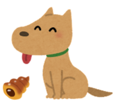

# dogs

Make Go functional with dogs

# Caution
This is a **highly-experimental** package. Any changes will be made in a backward-incompatible manner.

This package will not compile without `gotip` since type parameters are not supported currently in any of Go releases.

Probably **you don't need this** even after type parameters becomes GA. Even if you feel you do, maybe **you shouldn't use this**. It's against Go's philosophy.

# Features

We will continue to implement more utility types and functions.

## Type classes
* Eq
* Ord
* Semigroup
* Monoid

## Data types
* Pair
* Iterator

# Acknowledgements
This library is inspired mainly by:

* [Haskell standard library](https://hackage.haskell.org/package/base)
* [Scala Cats](https://typelevel.org/cats/)

and many other functional languages.

# License

Distributed under the Apache License, Version 2.0. See LICENSE for more information.
